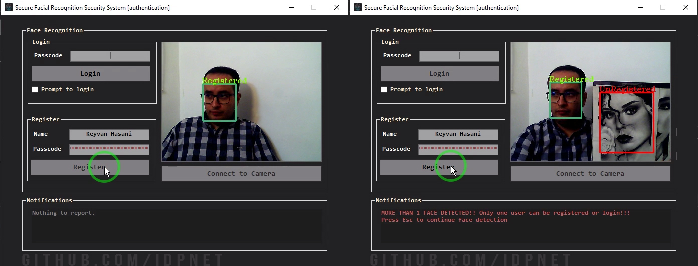

<br/>
<p align="center">
  <a href="https://github.com/idpNET/secure-facial-recognition-security-system-using-emguCV">
    
  </a>

  <h3 align="center">Secure Face Recognition Method for Authentication</h3>

  <p align="center">
    Capable of identifying both registered and unregistered users simultaneously , this project provides relatively decent security using PBKDF2 hashing and AES cryptography which help store user data securely in a SQL server database.
    <br/>
    <br/>
    <a href="https://github.com/idpNET/secure-facial-recognition-security-system-using-emguCV"><strong>Explore the docs »</strong></a>
    <br/>
    <br/>
    <a href="https://github.com/idpNET/secure-facial-recognition-security-system-using-emguCV/blob/master/Resources/Screenshot.jpg">View Demo</a>
    .
    <a href="https://github.com/idpNET/secure-facial-recognition-security-system-using-emguCV/issues">Report Bug</a>
    .
    <a href="https://github.com/idpNET/secure-facial-recognition-security-system-using-emguCV/issues">Request Feature</a>
  </p>
</p>

## Table Of Contents

* [About the Project](#about-the-project)
* [Built With](#built-with)
  * [Prerequisites](#prerequisites)
  * [Installation](#installation)
* [Usage](#usage)
* [Roadmap](#roadmap)
* [Contributing](#contributing)
* [License](#license)
* [Authors](#authors)

## About The Project



Using EmguCV, this face recognition project for authentication can simultaneously identify both registered and unregistered users, providing relatively decent security using PBKDF2 hashing and AES cryptography which help store user data securely in a SQL server database.

Main Capabilities:

* Detecting humans face and recognizing registered and unregistered users with pretty high precision and speed. 
* Storing sensitive data including face image and passcode in byte[] arrays, fully encrypted and hashed respectively. 
* Using a local SQL server database 
* Using a customizable notification panel 
* Object-oriented programming (OOP) paradigm friendly


## Built With

Face detection and recognition libraries

* [EmguCV](https://www.emgu.com)
* [OpenCV](https://opencv.org)

### Prerequisites

.NET Framework 4.8

### Installation


1. Download required binary files (release v1.0)
```sh
https://github.com/idpNET/secure-facial-recognition-security-system-using-emguCV.git
```
2. Clone the repo in visual studio
```sh
https://github.com/idpNET/secure-facial-recognition-security-system-using-emguCV.git
```
3. Right click on the project's title in the solution explorer and add the downloaded "x86" folder to the project folders.
4. For each dll file in the added x86 folder, set property "Copy to Output Directory" to "Copy if newer".
5. Rebuild the project for x86 debug platform
6. Get started!

## Usage

You need to plug your webcam first! Then try connecting to the webcam,  facing towards the camera to get your face detected. You can now register yourself with a name and a passcode. After a successful registration, you'll get labeled as a registered user.
Notice! The more images of your face registered with various gestures, the more you are likely to get recognized as a registered user! 
Try to train the program with various head positions in quite various directions, hitting the register button whenever your get labeled as unregistered user. This helps the face recognition algorithm to know more about your face (You need to register your face gestures with the same name) 

 In order to check the login, face towards the camera and enter your passcode. If authenticated successfully, you'll be directed to the welcoming page.

P.S This project is well commented ! You can refer to the inline code comments for more information

## Roadmap

See the [open issues](https://github.com/idpNET/secure-facial-recognition-security-system-using-emguCV/issues) for a list of proposed features (and known issues).

## Contributing

Contributions are what make the open source community such an amazing place to be learn, inspire, and create. Any contributions you make are **greatly appreciated**.
* If you have suggestions for adding or removing projects, feel free to [open an issue](https://github.com/idpNET/secure-facial-recognition-security-system-using-emguCV/issues/new) to discuss it, or directly create a pull request after you edit the *README.md* file with necessary changes.
* Please make sure you check your spelling and grammar.
* Create individual PR for each suggestion.
* Please also read through the [Code Of Conduct](https://github.com/idpNET/secure-facial-recognition-security-system-using-emguCV/blob/main/CODE_OF_CONDUCT.md) before posting your first idea as well.

### Creating A Pull Request

1. Fork the Project
2. Create your Feature Branch (`git checkout -b feature/AmazingFeature`)
3. Commit your Changes (`git commit -m 'Add some AmazingFeature'`)
4. Push to the Branch (`git push origin feature/AmazingFeature`)
5. Open a Pull Request

## License

 licensed under the GNU General Public License v3.0

## Authors

* **Keyvan Hasani** - *Back-end developer and Ideapardaz.NET Administrator* - [Keyvan Hasani](https://github.com/idpNET) - *Developer*
